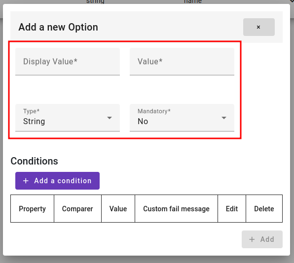
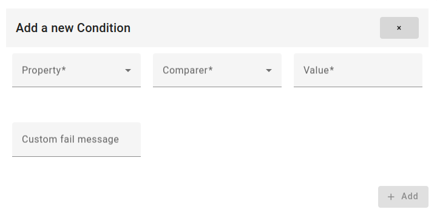

# Matchy Library

This library provides functionality to upload CSV files, match the file header with existing options, and validate the contents of the CSV files based on predefined conditions. The validation includes checking for mandatory fields, maximum or minimum length, and data type (string, integer, boolean, float, or regex pattern).

## Features

1- Upload CSV files
2- Match file header with existing options
3- Validate cells based on conditions
4- Directly update cells without altering the file
5- Visual indication of validation status (red for invalid, green for valid)

## Overview

For a quick testing, you can use it directly without any installtion via https://matchy-demo.web.app/

1- create an account
2- create your options

Here's a description for each field in the options object:


`display_value`: This field represents the value displayed to users. For instance, if the field represents a person's first name, the display_value might be "First Name".

`value`: The value field corresponds to the actual field name or identifier used in your database or backend systems. For example, if the field represents a person's first name and the database column is named "first_name", then value would be "first_name".

`mandatory`: This is a boolean field indicating whether the field is mandatory or required. If mandatory is set to true, it means that the field must have a value provided for it to be considered valid.

`type`: The type field specifies the data type of the field. It is typically represented by an enumeration Field Type with possible values (float, integer, string)

`conditions`: This field represents an array of conditions that need to be satisfied for the field to be considered valid.

Below is a description for each field in the Condition object:



`property`: This field is an enum representing the property of the data being evaluated in the condition. It can take one of three values:

- **value**: Indicates that the condition applies directly to the value itself.
- **regex**: Specifies that the condition involves a regular expression pattern match.
- **length**: Denotes that the condition pertains to the length of the value, such as string length or array length.

`comparer`: This field is an enum representing the comparison operation to be applied in the condition. It can take one of six values:

- **gt**: Greater than comparison.
- **gte**: Greater than or equal to comparison.
- **lt**: Less than comparison.
- **lte**: Less than or equal to comparison.
- **e**: Equality comparison.
- **in**: Membership comparison, checking if the value exists in a specified list or range.
value: This field represents the value against which the condition is evaluated. It can be a number, a string, or an array of strings. The type of value depends on the context of the condition and the property being evaluated.

`custom_fail_message`: This field contains a custom failure message that can be displayed if the condition is not met. It is optional and can be either a string or null. If provided, this message overrides any default failure message associated with the condition.

These fields collectively define the criteria for validating data against specific conditions. They allow for flexible and customizable validation rules to ensure that data meets the required criteria within the application.

## Using Matchy with Angular
First you need to copy the dist file from this repository to your angular app, then:

1- create a new componenet
2- your html file
```html
<div id="matchy"></div>
```
3- create a TS file containg some classes and enums to be able to create the options

```ts
export enum Comparer {
    gt = "gt",
    gte = "gte",
    lt = "lt",
    lte = "lte",
    e = "e",
    in = "in",
}

export enum ConditonProperty {
    value = "value",
    regex = "regex",
    length = "length",
}

export enum FieldType {
    float = "float",
    integer = "integer",
    string = "string",
    bool = "bool",
}

export class Condition {
    property: ConditonProperty;
    comparer: Comparer;
    value: number | string | string[];
    custom_fail_message: string | null;

    constructor(property: ConditonProperty, value: number | string | string[], comparer: Comparer = Comparer.e, custom_fail_message: string | null = null) {
        this.property = property;
        this.comparer = comparer;
        this.value = value;
        this.custom_fail_message = custom_fail_message;
    }
}

export class Option {
    display_value: string;
    value: string | null;
    mandatory: boolean;
    type: FieldType;
    conditions: Condition[];

    constructor(display_value: string = "", value: string | null  = null, mandatory: boolean = false, type: FieldType = FieldType.string, conditions: Condition[] = []) {
        this.display_value = display_value;
        this.mandatory = mandatory;
        this.type = type;
        this.value = value;
        this.conditions = conditions;
    }
}

```

3- let's get back to your TS file and create your options

```ts
import { Component, OnInit } from '@angular/core';
import { Matchy } from 'src/lib/dist/main';
import { Condition, Option, Comparer, ConditonProperty, FieldType} from 'src/models/classes/condition';

@Component({
  selector: 'app-root',
  templateUrl: './app.component.html',
  styleUrls: ['./app.component.css']
})
export class AppComponent implements OnInit {
  constructor() {}

  ngOnInit() {
    const options = [
      new Option("First Name", "first_name", true, FieldType.string, [
        new Condition(ConditonProperty.length, 20, Comparer.gte),
        new Condition(ConditonProperty.length, 30, Comparer.lt, "not safe choice"),
      ]),
      new Option("Last Name", "last_name", true, FieldType.string, [
        new Condition(ConditonProperty.value, ["AA", "BB"], Comparer.in)
      ]),
      new Option("Age", "age", true, FieldType.integer, [
        new Condition(ConditonProperty.value, 0, Comparer.gte),
        new Condition(ConditonProperty.value, 40, Comparer.lte),
      ]),
      new Option("Registration Number", "registration_num", true, FieldType.string, [
        new Condition(ConditonProperty.regex, '^\\d{8}-\\d{2}$'),
      ]),
      new Option("%", "percentage", true, FieldType.float, [
        new Condition(ConditonProperty.value, 0, Comparer.gte),
        new Condition(ConditonProperty.value, 100, Comparer.lte),
      ]),
    ];

    const matchy = new Matchy(options);

    document.getElementById("matchy")?.appendChild(matchy);
  }
}

```

## Using Matchy with React
First you need to copy the `src` file from this repository to your react app, then:

1- create a TS file containg some classes and enums to be able to create the options

```ts
export enum Comparer {
    gt = "gt",
    gte = "gte",
    lt = "lt",
    lte = "lte",
    e = "e",
    in = "in",
}

export enum ConditonProperty {
    value = "value",
    regex = "regex",
    length = "length",
}

export enum FieldType {
    float = "float",
    integer = "integer",
    string = "string",
    bool = "bool",
}

export class Condition {
    property: ConditonProperty;
    comparer: Comparer;
    value: number | string | string[];
    custom_fail_message: string | null;

    constructor(property: ConditonProperty, value: number | string | string[], comparer: Comparer = Comparer.e, custom_fail_message: string | null = null) {
        this.property = property;
        this.comparer = comparer;
        this.value = value;
        this.custom_fail_message = custom_fail_message;
    }
}

export class Option {
    display_value: string;
    value: string | null;
    mandatory: boolean;
    type: FieldType;
    conditions: Condition[];

    constructor(display_value: string = "", value: string | null  = null, mandatory: boolean = false, type: FieldType = FieldType.string, conditions: Condition[] = []) {
        this.display_value = display_value;
        this.mandatory = mandatory;
        this.type = type;
        this.value = value;
        this.conditions = conditions;
    }
}

```

2- Create the component which will use matchy

```ts
import { Matchy } from "path_to_matchy/src/main";
import { useEffect, useRef } from "react";
import { Condition, Option, Comparer, ConditonProperty, FieldType} from 'path_to_condition/condition';

const ComponentwithMatchy = () => {
  const matchyRef = useRef(null);
  const options = [
      new Option("First Name", "first_name", true, FieldType.string, [
        new Condition(ConditonProperty.length, 20, Comparer.gte),
        new Condition(ConditonProperty.length, 30, Comparer.lt, "not safe choice"),
      ]),
      new Option("Last Name", "last_name", true, FieldType.string, [
        new Condition(ConditonProperty.value, ["AA", "BB"], Comparer.in)
      ]),
      new Option("Age", "age", true, FieldType.integer, [
        new Condition(ConditonProperty.value, 0, Comparer.gte),
        new Condition(ConditonProperty.value, 40, Comparer.lte),
      ]),
      new Option("Registration Number", "registration_num", true, FieldType.string, [
        new Condition(ConditonProperty.regex, '^\\d{8}-\\d{2}$'),
      ]),
      new Option("%", "percentage", true, FieldType.float, [
        new Condition(ConditonProperty.value, 0, Comparer.gte),
        new Condition(ConditonProperty.value, 100, Comparer.lte),
      ]),
  ];
  useEffect(() => {
    const matchy_div = document.getElementById("matchy");
    if (matchy_div) {
      if (!matchy_div.querySelector("app-matchy")) {
        // To prevent inserting 2 times in case you have React.StrictMode
        matchy_div.appendChild(new Matchy(options));
      }
    }
  }, []);
  return (
      <div id="matchy" ref={matchyRef}></div>
    </>
  );
};

export default ComponentwithMatchy;

```

If you want to use the `dist` folder instead of `src`, you need just to import the  `main`
in `dist` and change `allowJs=true` in `tsconfig` file.

## Contributing
Contributions are welcome! Please feel free to submit a pull request.
Check contributions.md for more details

## Support
For any questions or issues, please open an issue.
